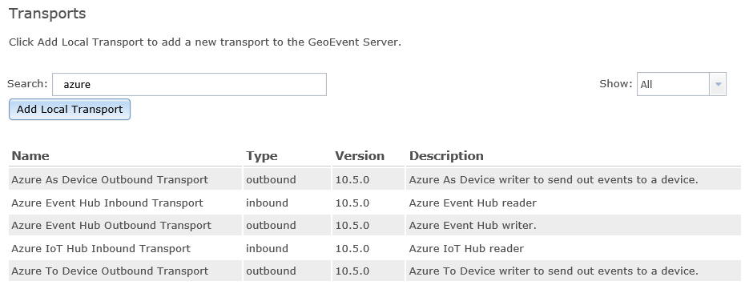

Introduction
============

[ArcGIS GeoEvent
Server](http://www.esri.com/software/arcgis/arcgisserver/extensions/geoevent-extension)
can be used to incorporate real-time event data into the ArcGIS platform,
satisfying a growing demand across multiple industries to include real-time
streaming data into everyday GIS applications, workflows, and analyses.

The Azure Connector for GeoEvent Server allows you to receive real-time data
from Microsoft Azure hubs and devices. This tutorial will walk you through
getting started deploying the Azure Connector for GeoEvent Server.

Prerequisites
=============

In order to use the Azure Connector for GeoEvent Server you must have:

1.  ArcGIS Server and ArcGIS GeoEvent Server installed and configured.

2.  Microsoft Azure account (sign up for a free account at
    <https://azure.microsoft.com/> or use your Enterprise account).

Login to you Microsoft Azure Account
====================================

As stated in the Prerequisites section above, you will need a Microsoft Azure
account to proceed with this tutorial. If you do not have one click the link
above to create one.

1.  In a web browser, navigate to <https://azure.microsoft.com/> and click
    PORTAL in the upper right and login with your credentials

Working with the Azure IoT Hub Connector for GeoEvent Server
============================================================

In order to get started with the Azure Connector for GeoEvent Server you must
deploy the transports and then import a configuration file that creates the
distinct connector types.

**Add the Azure transports to GeoEvent Server**

In this section, you will add the Azure transports to GeoEvent Server.

1.  In *GeoEvent Manager*, navigate to **Site** \> **Components** \>
    **Transports** and click **Add Local Transport**.

2.  Click **Choose Files** and browse to the *components* folder provided with
    this connector (…\\AzureConnectorForGeoEvent…\\components).

3.  Select the **azure-device-transport-10.5.0.jar** file and click **Open**.

4.  Click **Add** to add the new transport to GeoEvent Server. It will now
    appear in the list of *Transports*.

    *NOTE: The version number of the transport may differ from your version of
    GeoEvent Server and other transports. However, the Azure Connector is
    supported on all 10.5.x versions of GeoEvent Server.*

5.  Repeat steps 1-4 with each of the remaining transports in the *components*
    folder.

6.  In the search box enter **azure** and five transports should be displayed.

    

**Import the Connectors configuration file**

In this section, you will import a configuration file that creates the Azure
Connectors.

1.  In *GeoEvent Manager*, navigate to **Site** \> **Configuration Store** \>
    and click **Import Configuration**.

2.  Click **browse** and navigate to the *components* folder provided with this
    connector (…\\AzureConnectorForGeoEvent…\\components).

3.  Select the **connectors.xml** file and click **Next**.

4.  Select **Import Configuration** and click **Next**.

5.  Navigate to **Site** \> **Connectors.**

6.  In the search box enter **azure** and **ten** connectors should be
    displayed.

Configure the Azure Connector
-----------------------------

