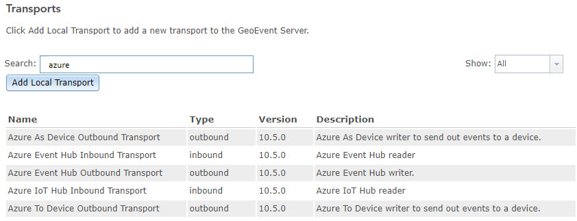
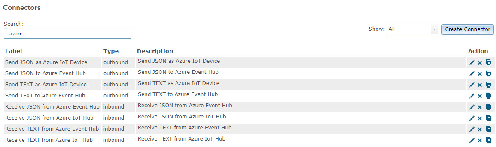

# Microsoft Azure Connectors

ArcGIS GeoEvent Server sample Azure connectors for connecting to Microsoft Azure Hubs and Devices.

## Features
* Azure Transport and Connectors

## Instructions

Building the source code:

1. Make sure Maven and ArcGIS GeoEvent Server SDK are installed on your machine.
2. Run 'mvn install -Dcontact.address=[YourContactEmailAddress]'

Requirements

* ArcGIS GeoEvent Server (Certified with version 10.5.x).
* ArcGIS GeoEvent Server SDK.
* Java JDK 1.8 or greater.
* Maven.

Downloading the Compiled JAR and Configuration files

1. Download the zipped file from Box [here](https://esri.box.com/s/02dgqajtw8vh19j4l6n178sbzclan6c2) (MD5 Checksum 37bde1bcab514e309b5b987dc89c6ccc)
2. Extract to a local folder.

## Deploying the Connectors

[ArcGIS GeoEvent
Server](http://www.esri.com/software/arcgis/arcgisserver/extensions/geoevent-extension)
can be used to incorporate real-time event data into the ArcGIS platform,
satisfying a growing demand across multiple industries to include real-time
streaming data into everyday GIS applications, workflows, and analyses.

The Azure Connector for GeoEvent Server allows you to receive real-time data
from Microsoft Azure hubs and devices. This tutorial will walk you through
deploying the Azure Connector for GeoEvent Server.

*This help document was written specifically for the compiled version of this
connector available* [here](https://esri.box.com/s/02dgqajtw8vh19j4l6n178sbzclan6c2)*. If you choose to download the
code and compile the files yourself, you will need to locate the corresponding
file referenced at each step.*

## Prerequisites

In order to use the Azure Connector for GeoEvent Server you must have:

1.  ArcGIS Server and ArcGIS GeoEvent Server installed and configured.

2.  Microsoft Azure account (sign up for a free account at
    <https://azure.microsoft.com/> or use your Enterprise account).

## Login to you Microsoft Azure Account

As stated in the Prerequisites section above, you will need a Microsoft Azure
account to proceed with this tutorial. If you do not have one click the link
above to create one.

In a web browser, navigate to <https://azure.microsoft.com/> and click
**PORTAL** in the upper right and login with your credentials. Once logged in
you will need to create or have access to an existing storage account and IoT
Hub.

More information on setting these up or the Microsoft Azure architecture is
available at the following links:

<https://docs.microsoft.com/en-us/azure/iot-hub/iot-hub-create-through-portal>

<https://docs.microsoft.com/en-us/azure/iot-hub/iot-hub-what-is-azure-iot>

## Working with the Azure Connector for GeoEvent Server

In order to get started with the Azure Connector for GeoEvent Server you must
deploy the transports and then import a configuration file that creates the
distinct connector types.

*Add the Azure transports to GeoEvent Server*

In this section, you will add the Azure transports to GeoEvent Server.

1.  In *GeoEvent Manager*, navigate to **Site** \> **Components** \>
    **Transports** and click **Add Local Transport**.

2.  Click **Choose Files** and browse to the *components* folder provided with
    this connector (…\\AzureConnectorForGeoEvent…\\components).

3.  Select the **azure-device-transport-10.5.0.jar** file and click **Open**.

4.  Click **Add** to add the new transport to GeoEvent Server. It will now
    appear in the list of *Transports*.

    *NOTE: The version number of the transport may differ from your version of
    GeoEvent Server and other transports. However, the Azure Connector is
    supported on all 10.5.x versions of GeoEvent Server.*

5.  Repeat steps 1-4 with each of the remaining transports in the *components*
    folder.

6.  In the search box enter **azure** and five transports should be displayed.

    

*Import the Connectors configuration file*

In this section, you will import a configuration file that creates the Azure
Connectors.

1.  In *GeoEvent Manager*, navigate to **Site** \> **Configuration Store** \>
    and click **Import Configuration**.

2.  Click **browse** and navigate to the *components* folder provided with this
    connector (…\\AzureConnectorForGeoEvent…\\components).

3.  Select the **connectors.xml** file and click **Next**.

4.  Select **Import Configuration** and click **Next**.

5.  Navigate to **Site** \> **Connectors.**

6.  In the search box enter **azure** and eight connectors should be displayed.

    

## Resources

* [ArcGIS GeoEvent Gallery](http://links.esri.com/geovent-gallery) 
* [ArcGIS GeoEvent Server Resources](http://links.esri.com/geoevent)
* [ArcGIS Blog](http://blogs.esri.com/esri/arcgis/)
* [twitter@esri](http://twitter.com/esri)

## Issues

Find a bug or want to request a new feature?  Please let us know by submitting an issue.

## Contributing

Esri welcomes contributions from anyone and everyone. Please see our [guidelines for contributing](https://github.com/esri/contributing).

Copyright 2017 Esri

Licensed under the Apache License, Version 2.0 (the "License"); you may not use this file except in compliance with the License. You may obtain a copy of the License at

http://www.apache.org/licenses/LICENSE-2.0

Unless required by applicable law or agreed to in writing, software distributed under the License is distributed on an "AS IS" BASIS, WITHOUT WARRANTIES OR CONDITIONS OF ANY KIND, either express or implied. See the License for the specific language governing permissions and limitations under the License.

A copy of the license is available in the repository's [license.txt](license.txt?raw=true) file.
